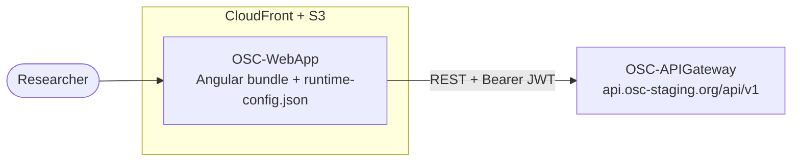

# OSC-WebApp

> The web front end of the Open Science Chain – Information System (OSC-IS): the Angular single-page application researchers use to register, browse, and verify research **artifacts** and **workflows** on the blockchain.

OSC-WebApp talks only to the [API Gateway](../OSC-APIGateway). It never sees RabbitMQ, the workers, OSC-API, or the blockchain — everything is mediated by the gateway's REST API.

---

## Executive summary

This is the human face of OSC-IS. A researcher uses it to:

- **Sign in** and have their role (PI, Collaborator, Admin) determine what they can do.
- **Browse** the catalog of artifacts and workflows registered on the chain.
- **Contribute** a new artifact (compute file hashes locally, attach metadata, submit) or assemble a **workflow** from artifacts and GitHub repositories.
- **Inspect provenance** — view an artifact's immutable on-chain history and drill into any historical snapshot.

Two design choices stand out for a reviewer:

1. **One build runs everywhere.** The API endpoint is read at *runtime* from a config file, not baked in at build time — the exact same compiled bundle serves local development and staging, configured by a single JSON file in S3.
2. **The UI is security-aware but not security-authoritative.** Route guards and role checks shape what the user *sees*, while the API Gateway remains the real enforcement point. The two layers agree on the same role model (`pi` / `collaborator` may contribute; `admin` administers).

---

## Technology stack

| Concern | Choice |
|---|---|
| Framework | Angular 19 (standalone components + lazy-loaded feature modules) |
| Rendering | Client-side SPA with **server-side rendering + hydration** (`server.ts`, `provideClientHydration`) |
| Language | TypeScript |
| HTTP | `HttpClient` with a functional **auth interceptor** |
| State | RxJS (`BehaviorSubject` for auth state) + component state |
| Auth | JWT (localStorage), decoded client-side for role-aware UI |
| UI/UX | Bootstrap styles, `ngx-toastr` notifications |
| Hashing | `crypto-js` for client-side file footprints |
| Testing | Unit specs (`*.spec.ts`) + **Cypress** E2E |
| Hosting | Static build in **S3**, served via **CloudFront** |

---

## How it fits in the system



`runtime-config.json` (served alongside the bundle) provides `API_BASE_URL`. At staging this is the absolute gateway URL (`https://api.osc-staging.org/api/v1`); for local dev it points at `http://localhost:3000/api/v1`.

---

## Application structure

```
src/app/
├── app.config.ts            # Standalone bootstrap: router, HttpClient + interceptor, runtime-config init
├── app.routes.ts            # Top-level routes (lazy-loaded)
├── auth/                    # Sign-in, auth module/routes, AuthService, forbidden page
├── guards/                  # authGuard, canCreateArtifactGuard (role.guard)
├── interceptors/            # auth.interceptor — attaches Bearer token, handles 401
├── services/               # api-base-url (runtime config resolution), workflow.service, runtime-config.service
├── artifacts/              # list / detail / create / update / get-history / history-detail + artifact.service + history-cache
├── components/             # Reusable UI: artifact-card, file-upload-section, metadata form, workflow-* components
└── models/                 # Artifact, Workflow, ArtifactHistory typed models
```

### Route map

| Path | Component | Guard |
|---|---|---|
| `/auth/**` | Sign-in (lazy module) | — |
| `/list-artifacts`, `/artifacts/:id` | Artifact list / detail | — (public read) |
| `/contribute` | Create artifact | `canCreateArtifactGuard` (PI/Collaborator) |
| `/update-artifact/:id` | Update artifact | `canCreateArtifactGuard` |
| `/artifacts/:id/history`, `/artifacts/:id/history/:txId` | On-chain history + snapshot | `authGuard` |
| `/list-workflows`, `/workflows/:id` | Workflow list / detail | — |
| `/create-workflow`, `/update-workflow/:id` | Workflow create / update | `canCreateArtifactGuard` |
| `/forbidden` | Access-denied page | — |

---

## Authentication & roles (client side)

- **Login** posts to `/users/login`; the returned JWT is stored in `localStorage` with a computed expiry (`tokenData`).
- The token is **decoded client-side** to drive role-aware UI (`isPI`, `isCollaborator`, `isAdmin`, `canCreateArtifact = PI || Collaborator`).
- A background timer re-validates the token **locally and against the backend** (`/users/validate-token`) every 5 minutes; expiry or a 401/403 cleans up the session.
- The **auth interceptor** attaches `Authorization: Bearer <token>` to every request whose URL matches the configured API base (including the cross-origin `api.osc-staging.org`) and redirects to sign-in on a 401.

> The UI enforces visibility, not authority. The API Gateway independently enforces RBAC — a user who bypasses the UI still cannot perform an unauthorized action.

---

## Running locally

```bash
npm install
npx ng serve            # http://localhost:4200, expects the gateway on :3000
```

Ensure `src/assets/runtime-config.json` points `API_BASE_URL` at your local gateway. For Cypress runs, the base URL can also be overridden via `localStorage` without a rebuild.

### Build & deploy (staging)

```bash
npx ng build --configuration=production
aws s3 sync dist/osc-web-app/browser/ s3://osc-staging-web/ --delete
aws cloudfront create-invalidation --distribution-id <id> --paths "/*"
```

> The production build outputs to `dist/osc-web-app/browser/`; that subfolder (not the `dist` root) is what gets synced to the bucket root.

---

## Testing

```bash
npx ng test                      # unit specs
npx cypress open                 # interactive E2E
npx cypress run                  # headless E2E
```

Cypress E2E covers the full submission → history flow against a running stack (local or staging).

---

## Documentation

| Document | Contents |
|---|---|
| [docs/ARCHITECTURE.md](docs/ARCHITECTURE.md) | Front-end architectural patterns, tactics, prioritized quality attributes, and the runtime-config & security design. |

---

*Part of the OSC-IS platform: [OSC-APIGateway](../OSC-APIGateway) · [OSC-Artifact-Submission](../OSC-Artifact-Submission) · [OSC-IS-Infra](../OSC-IS-Infra) · [OSC-API](../OSC-API) · [OSC-Chaincode](../OSC-Chaincode) · [OSC-Docker](../OSC-Docker) · [OSC-Network](../OSC-Network).*
