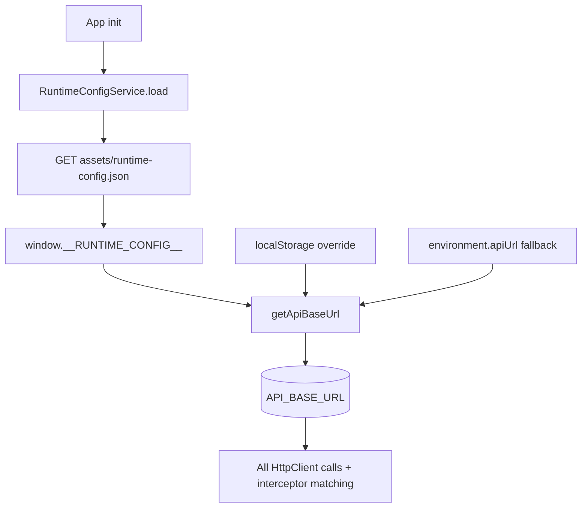
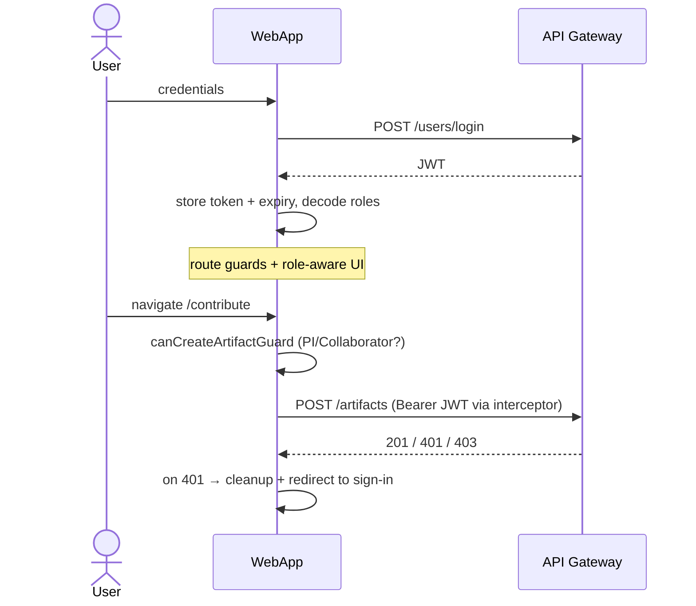

# OSC-WebApp — Architecture

This document describes the front-end architecture of OSC-IS: the **patterns and tactics** used in the Angular application, the **quality attributes** they target, and the **trade-offs** taken.

- [1. Architectural context](#1-architectural-context)
- [2. Prioritized quality attributes](#2-prioritized-quality-attributes)
- [3. Architectural patterns](#3-architectural-patterns)
- [4. Tactics by quality attribute](#4-tactics-by-quality-attribute)
- [5. Runtime configuration (one build, many environments)](#5-runtime-configuration-one-build-many-environments)
- [6. Security model](#6-security-model)
- [7. Key scenarios](#7-key-scenarios)
- [8. Trade-offs and constraints](#8-trade-offs-and-constraints)

---

## 1. Architectural context

The web app is a **single-page application** that is the sole human interface to OSC-IS. Its architectural concerns are those of a modern SPA that (a) must be deployed as static assets to a CDN, (b) must authenticate users against a separate API origin, and (c) must present blockchain-backed data whose write path is asynchronous and whose read path can be slow.

Three forces shape the design:

1. **Deploy once, run in many environments.** The same compiled artifact is promoted from local to staging; the API endpoint must therefore be a *runtime* input, not a compile-time constant.
2. **Cross-origin, token-based API.** The app is served from `osc-staging.org` but calls `api.osc-staging.org`; auth must travel as a bearer token attached to exactly the right requests.
3. **Eventually consistent back end.** Newly submitted artifacts are `PENDING` until the chain confirms; the UI must represent that honestly and let users inspect immutable history.

---

## 2. Prioritized quality attributes

| # | Quality attribute | Why prioritized | Representative scenario |
|---|---|---|---|
| 1 | **Usability** | Researchers are the primary users; the flow from file → hashed → submitted must be clear and forgiving. | A user drops files; the app hashes them client-side and shows a footprint before submission. |
| 2 | **Security** | The app handles credentials and authorization-sensitive actions. | An expired token triggers automatic logout; only PI/Collaborator see "Contribute". |
| 3 | **Deployability / portability** | One bundle must serve multiple environments from a CDN. | The same S3 artifact runs locally and in staging via a swapped `runtime-config.json`. |
| 4 | **Performance** | Catalog and history browsing must feel instant despite a slow ledger. | History snapshots are served from an in-memory LRU cache on repeat views. |
| 5 | **Modifiability** | New entity types (workflows) are added alongside artifacts. | Workflows reuse the same routing/guard/service shape as artifacts. |
| 6 | **Testability** | Regressions in the submission/history flow are expensive. | Cypress E2E exercises the full flow; the API base URL is overridable for test isolation. |

---

## 3. Architectural patterns

### 3.1 Single-page application + component architecture

The UI is composed of **standalone Angular components** assembled into feature areas (auth, artifacts, workflows). Reusable presentation pieces (`artifact-card`, `file-upload-section`, `artifact-metadata-form`, `workflow-card`) are isolated from page-level container components.

### 3.2 Lazy-loaded feature modules / routes

Top-level routes use `loadChildren` / `loadComponent` so each feature is a separately downloaded chunk. This keeps the initial bundle small and localizes change to a feature.

### 3.3 Layered front end (component → service → HTTP)

Components hold view state; **injectable services** (`AuthService`, `ArtifactService`, `WorkflowService`, `HistoryCacheService`) own API communication and cross-cutting logic. Components never call `HttpClient` directly for domain data.

### 3.4 Interceptor (cross-cutting auth)

A functional `HttpInterceptor` centralizes token attachment and 401 handling for every outbound request, so no component repeats auth logic. It matches internal requests by the **runtime-resolved API base URL**, correctly covering the cross-origin gateway.

### 3.5 Route guards (policy at navigation boundaries)

Functional guards (`authGuard`, `canCreateArtifactGuard`) gate navigation by authentication and role, redirecting unauthenticated users to sign-in and unauthorized users to `/forbidden`.

### 3.6 Externalized runtime configuration

`API_BASE_URL` is resolved at runtime from `window.__RUNTIME_CONFIG__` (loaded from `assets/runtime-config.json` during app initialization), with a `localStorage` override for tests and an environment fallback. See [§5](#5-runtime-configuration-one-build-many-environments).

### 3.7 Client-side cache-aside (history)

`HistoryCacheService` is a small **LRU cache** (Map with most-recent promotion, capped at 200 entries) for artifact-history snapshots, so navigating back to a snapshot doesn't re-hit the gateway.

### 3.8 Reactive state

Auth state is exposed as an RxJS `BehaviorSubject` (`isAuthenticated$`) so the shell and components react to login/logout without manual wiring.

### 3.9 SSR + hydration

The app is server-rendered (`server.ts`) and hydrated on the client (`provideClientHydration`) for faster first paint and better crawlability.

---

## 4. Tactics by quality attribute

### Usability

| Tactic | Implementation |
|---|---|
| **Immediate feedback** | `ngx-toastr` notifications on auth, validation, and submission outcomes. |
| **Client-side integrity preview** | `crypto-js` computes file footprints in the browser before submission. |
| **Honest state representation** | `submissionState` (PENDING/SUCCESS/FAILED) surfaced so users understand the async write. |
| **Guard-driven guidance** | Unauthorized actions redirect with an explanatory toast rather than failing silently. |

### Security

| Tactic | Implementation |
|---|---|
| **Token lifecycle management** | JWT stored with computed expiry; periodic local + backend revalidation (5-min timer); auto-logout on expiry/401/403. |
| **Authorize at navigation** | `canCreateArtifactGuard` restricts contribute/update routes to PI/Collaborator. |
| **Correct credential scoping** | Interceptor attaches the bearer token only to API-base-matching requests. |
| **Defense in depth** | UI gating complements (never replaces) gateway-side RBAC. |

### Deployability / portability

| Tactic | Implementation |
|---|---|
| **Externalize configuration** | Runtime `API_BASE_URL`; identical bundle across environments. |
| **Static hosting** | Build artifact deployed to S3 + CloudFront; no server runtime to operate (SSR is build-time/edge-capable). |
| **Test override hook** | `localStorage` API base override for Cypress without rebuilds. |

### Performance

| Tactic | Implementation |
|---|---|
| **Lazy loading** | Per-feature chunks reduce initial load. |
| **Client cache** | LRU history cache avoids repeat gateway calls. |
| **SSR + hydration** | Faster first contentful paint. |

### Modifiability / testability

| Tactic | Implementation |
|---|---|
| **Generalize the pattern** | Workflows mirror artifacts (routes, guards, service). |
| **Service abstraction** | API base resolution centralized in `api-base-url.ts`. |
| **E2E coverage** | Cypress specs for submission → history. |

---

## 5. Runtime configuration (one build, many environments)

Resolution order in `getApiBaseUrl()`:

1. `window.__RUNTIME_CONFIG__.API_BASE_URL` (from `runtime-config.json`) — the production mechanism.
2. `localStorage['API_BASE_URL']` / `USE_STAGING_API` — test/dev overrides.
3. `environment.apiUrl` — compile-time fallback.
4. `http://localhost:3000/api/v1` — last-resort default.

This is the linchpin of the deploy-once strategy: the staging bundle and a local build are byte-identical; only the JSON file differs. It also resolved a class of login failures — when the API moved to a different origin (`api.osc-staging.org`), the interceptor's internal-request test had to match the configured base URL so the bearer token would be attached cross-origin.

---

## 6. Security model

The client decodes the JWT purely to **shape the UI**; the API Gateway re-checks every protected action server-side. The two share the role vocabulary (`admin`, `pi`, `collaborator`).

---

## 7. Key scenarios

- **Contribute an artifact:** select files → client-side hashing (`crypto-js`) → metadata form → `POST /artifacts` (guarded, token-attached) → optimistic success while the chain write proceeds asynchronously.
- **View provenance:** open `/artifacts/:id/history` (auth-guarded) → gateway proxies to the Get-History Worker → snapshots cached client-side for fast re-navigation to `/history/:txId`.
- **Assemble a workflow:** select artifacts + add GitHub repositories → `create-workflow` (guarded) → same async submission semantics as artifacts.

---

## 8. Trade-offs and constraints

| Decision | Benefit | Cost / risk |
|---|---|---|
| Runtime config over build-time env | One bundle for all environments; instant repoint. | A misconfigured `runtime-config.json` breaks API calls at runtime, not build time. |
| JWT in `localStorage` | Simple, survives reloads; works with a static host. | Susceptible to XSS token theft; mitigated by short TTLs, output encoding, and CSP discipline. |
| Client-side role gating | Responsive, clear UX. | Not a security boundary on its own — must be backed by gateway RBAC (it is). |
| LRU history cache | Fast re-views, less gateway load. | Possible staleness; bounded by cache size and the "refresh history" action. |
| SSR + hydration | Faster first paint, better SEO. | Added build/runtime complexity vs a pure CSR SPA. |

---

*See [OSC-APIGateway/docs/ARCHITECTURE.md](../../OSC-APIGateway/docs/ARCHITECTURE.md) for the server-side counterpart of the auth and submission model.*
